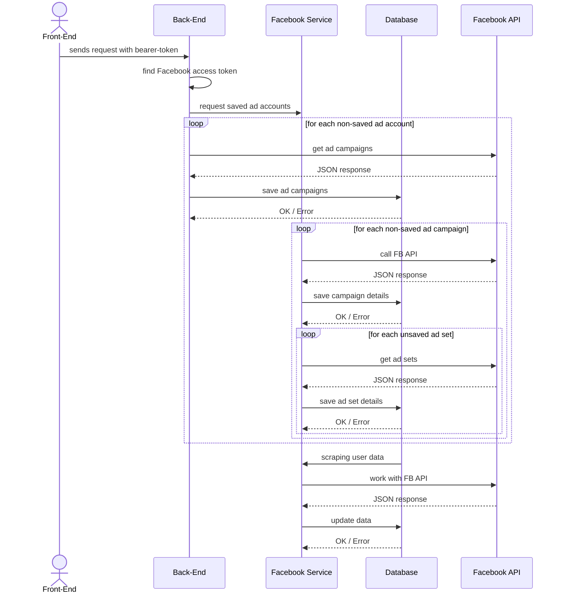

# uml-folder

## Prompts

### General UML prompt

```text
I need a UML diagram for facebook ad sets saving, which involves FE(front-end) BE(back-end)  FB Service(Facebook Service) DB(Data-base) and FB API(Facebook API)

with the workflow for:
-  FE calling BE with a bearer-token 
- BE findind a correcponding facebook-access-token related to this user
- BE check with "FB Service" saved ad-accounts
 - - for each non saved ad-account it calls FB API to get it ad-comapigns (saves them to DB)
 - - - for each non saved ad-comapign it FB-Sevice Calls FB API (saves them to DB) 
```

### Updating the UML

```text
I need yoou to update the diagram so  FB API and DB would return a resoponse back to FB Service

DB return OK on success, Error on failure
FB API returns a json(serch for corresponding JSON response for GET ad-accounts / ad compaigns / ad-sets) on success, and ERROR JSON on failure(serch for corresponding JSON for it)
Add an extra step after saving all ad-campaigns:
 --- for each ad-compaign serch for unsaved ad-set, call FB API, then save into DB
```

