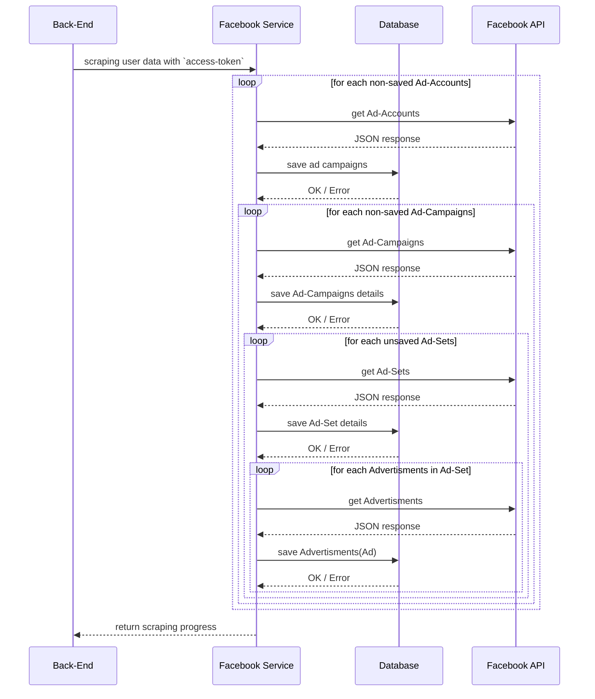

```mermaid
sequenceDiagram
    participant BE as Back-End
    participant FBS as Facebook Service
    participant DB as Database
    participant FBAPI as Facebook API

    BE->>FBS: scraping user data with `access-token`
    loop for each non-saved Ad-Accounts
        FBS->>FBAPI: get Ad-Accounts
        FBAPI-->>FBS: JSON response
        FBS->>DB: save ad campaigns
        DB-->>FBS: OK / Error
        loop for each non-saved Ad-Campaigns
            FBS->>FBAPI: get Ad-Campaigns
            FBAPI-->>FBS: JSON response
            FBS->>DB: save Ad-Campaigns details
            DB-->>FBS: OK / Error
            loop for each unsaved Ad-Sets
                FBS->>FBAPI: get Ad-Sets
                FBAPI-->>FBS: JSON response
                FBS->>DB: save Ad-Set details
                DB-->>FBS: OK / Error
                loop for each Advertisments in Ad-Set
                    FBS->>FBAPI: get Advertisments
                    FBAPI-->>FBS: JSON response
                    FBS->>DB: save Advertisments(Ad)
                    DB-->>FBS: OK / Error
                end
            end
        end
    end
    FBS-->>BE: return scraping progress
```