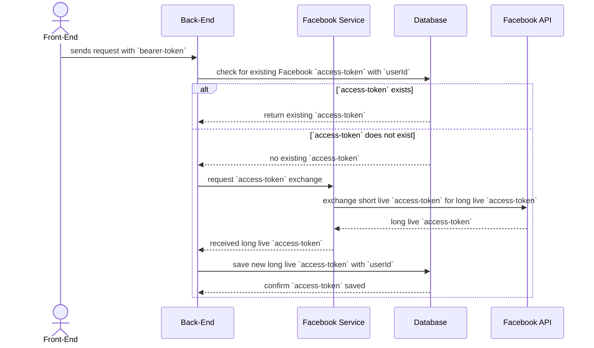

```mermaid
sequenceDiagram
    actor FE as Front-End
    participant BE as Back-End
    participant FBS as Facebook Service
    participant DB as Database
    participant FBAPI as Facebook API

    FE->>BE: sends request with `bearer-token`
    BE->>DB: check for existing Facebook `access-token` with `userId`
    alt `access-token` exists
        DB-->>BE: return existing `access-token`
    else `access-token` does not exist
        DB-->>BE: no existing `access-token`
        BE->>FBS: request `access-token` exchange
        FBS->>FBAPI: exchange short live `access-token` for long live `access-token`
        FBAPI-->>FBS: long live `access-token`
        FBS-->>BE: received long live `access-token`
        BE->>DB: save new long live `access-token` with `userId`
        DB-->>BE: confirm `access-token` saved
    end
```